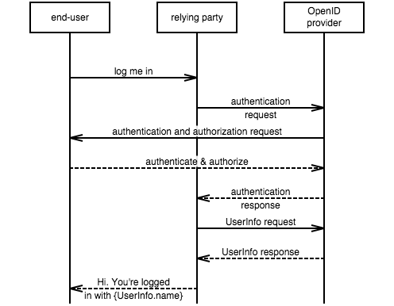

# mscgenjs-inpage
_embed & render MscGen in HTML_

## Usage
(1) Reference the mscgen-inpage **script** in your **page head**:
```html
<script src="dist/mscgen-inpage.js" defer></script>
```
(2) Put your mscgen script in the page, surrounded by a tag with **`mscgen_js`**
as one of its **`class`** attributes.
```html
    <pre class="mscgen_js">
    # OpenId Connect protocol
    # https://openid.net/specs/openid-connect-core-1_0.html#rfc.section.1.3
    msc {
      wordwraparcs="true";

      eu [label="end-user"],
      rp [label="relying party"],
      op [label="OpenID provider"];

      eu =>> rp [label="log me in"];
      rp =>> op [label="authentication request"];
      op =>> eu [label="authentication and authorization request"];
      eu >> op [label="authenticate and authorize"];
      op >> rp [label="authentication response"];
      rp =>> op [label="UserInfo request"];
      op >> rp [label="UserInfo response"];
      rp >> eu [label="Hi. You're logged in with {UserInfo.name}"];
    }
    </pre>
```

(3) **You're done**. The script replaces all elements in the page with the class
mscgen_js by a rendered sequence chart. Result for the above msc:    


> We've used `pre` in the sample above, but mscgen_js will work with any
  element type. You can even use `<script>` and wikimedia-style `<mscgen>`
  tags - see the [mscgen_js embedding guide](https://sverweij.github.io/mscgen_js/embed.html)
  if you want to do this.

## More
- The [mscgen_js embedding guide](https://sverweij.github.io/mscgen_js/embed.html)
  covers more options, e.g.:
  - How to read MscGen from external files.
  - How to embed MscGen in Atlassian Confluence.
  - Using `<script>` or `<mscgen>` for rendering.
  - Making the charts clickable, so they open in the on line interpreter.
  - Using other sequence chart languages (like Xù and MsGenny)
- If you want to write MscGen: it's a doddle in the
  [on line interpreter](https://sverweij.github.io/mscgen_js) or the
  [atom package](https://atom.io/packages/mscgen-preview).
- This (npm) package will replace the provisional [bower
  package](https://github.com/mscgenjs/mscgen_js-inpage-package) released
  in 2015.


## Licensing: GPL-3.0 with a relaxation
[mscgen_js](https://github.com/sverweij/mscgen_js) is licensed under the GNU
General Public License version 3 ("the GPL").

For using mscgenjs-inpage (in this package: `dist/mscgen-inpage.js`) a special
exception to the GPL is made. This is so you can use it to render sequence
charts in documentation which has a different license from the GPL without that
documention (let alone the software it documents, if any) having to be licensed
under the GPL.

> As a special exception to the GPL, any HTML file which merely makes function
calls to mscgen-inpage.js, and for that purpose includes it by reference shall
be deemed a separate work for copyright law purposes. In addition, the copyright
holders of this code give you permission to combine this code with free software
libraries that are released under the GNU LGPL. You may copy and distribute such
a system following the terms of the GNU GPL for this code and the LGPL for the
libraries. If you modify this code, you may extend this exception to your
version of the code, but you are not obligated to do so. If you do not wish to
do so, delete this exception statement from your version.
