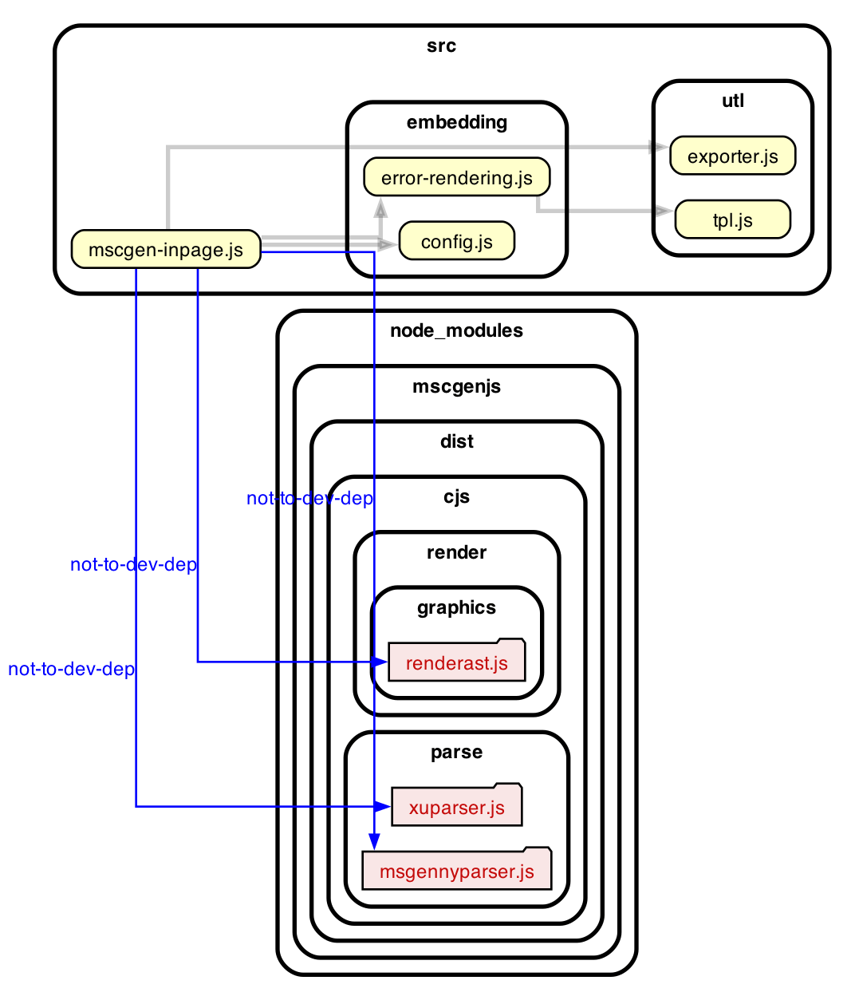

### Dependency graph

Below is a dependency graph of the mscgenjs inpage module. Click on it to
go to a slightly more interactive version that allows you to navigate the
source by clicking the nodes.

